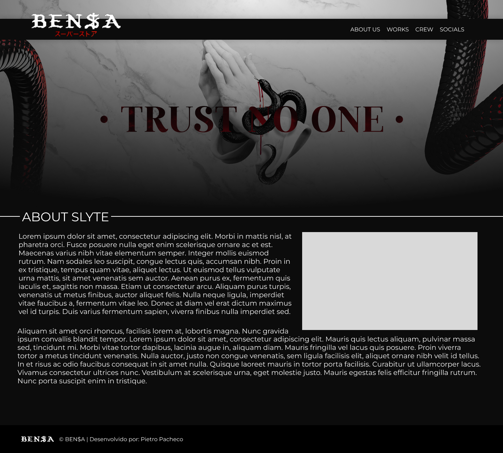

<h1 align=center>BEN$A</h1>

Projeto realizado em 2023, como método de aprendizagem pessoal.

<a href="https://www.figma.com/design/pijsRM2M3vdiDAzaUzse1z/BEN%24A%2FSlyte?m=auto&t=dkh7qoVD7hmh0JoV-6">Prototipação</a>&nbsp&nbsp
|&nbsp&nbsp <a href="https://github.com/ptrpacheco">Mais Projetos</a>

    

## 💁‍♂️ Sobre o Projeto
O Projeto trata-se de um Website, inicialmente destinado ao grupo de criadores de conteúdo chamado _Slyte_ (por isso alguns erros notados no Figma), agora destinado a outro grupo chamado [_BEN$A_](https://bensa.com.br/), destacando suas conquistas, equipes e informações.

## 📅 Desenvolvimento
O projeto foi realizado no primeiro semestre de 2023, período onde toquei pela primeira vez no ambiente digital. Sendo prototipado, inicialmente, no [Figma](https://figma.com/)

## 🤖 Tecnologias
Esse projeto foi realizado com as seguintes tecnologias:
<ul>
    <li>HTML e CSS</li>
    <li>Git e GitHub</li>
    <li>Figma</li>
</ul>

##

Desenvolvido por Pietro Pacheco 👤 Minhas redes sociais: <a href="https://linktr.ee/pietropacheco">Linktree</a>
